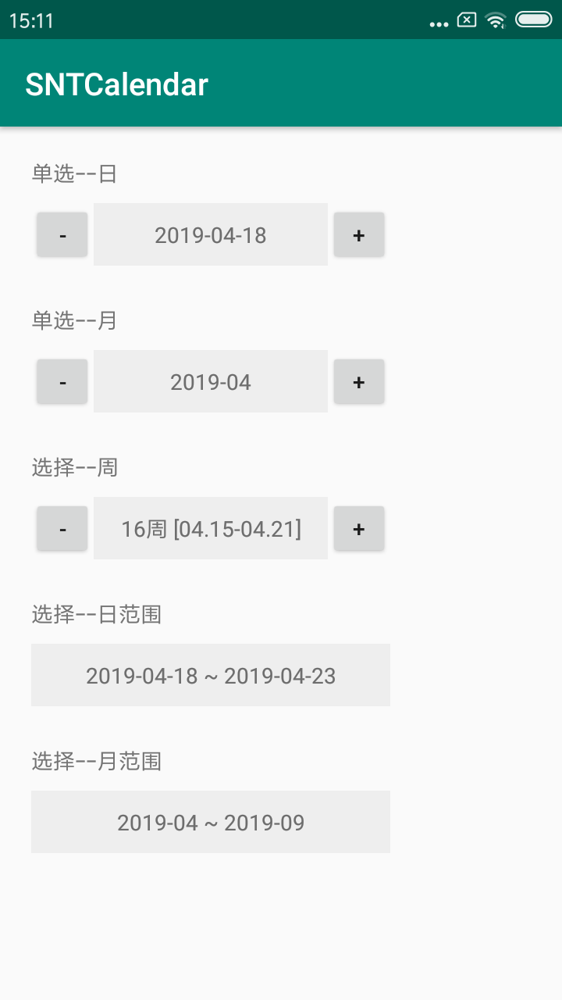
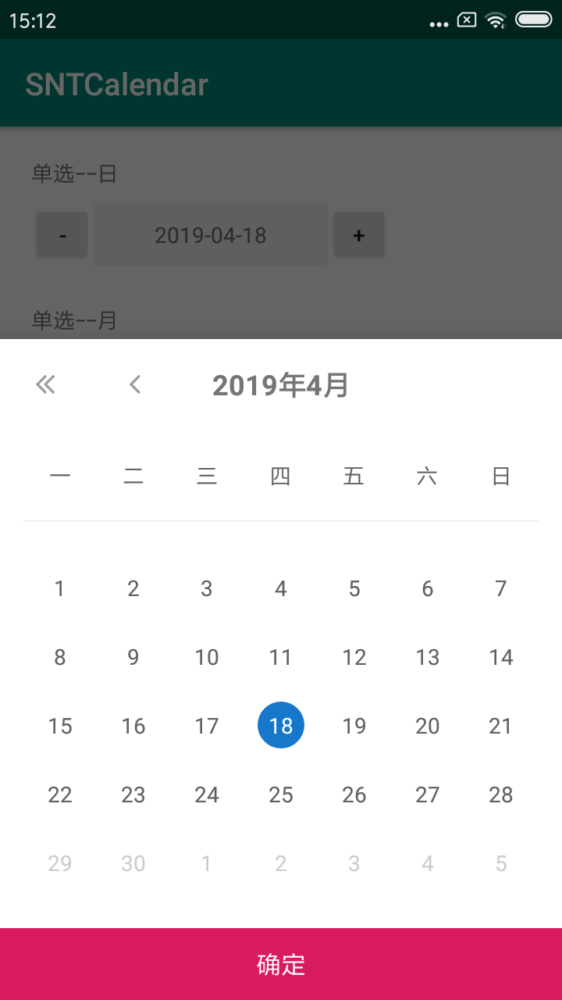
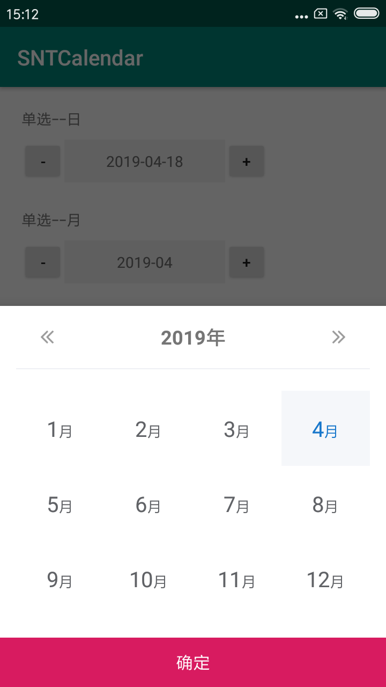
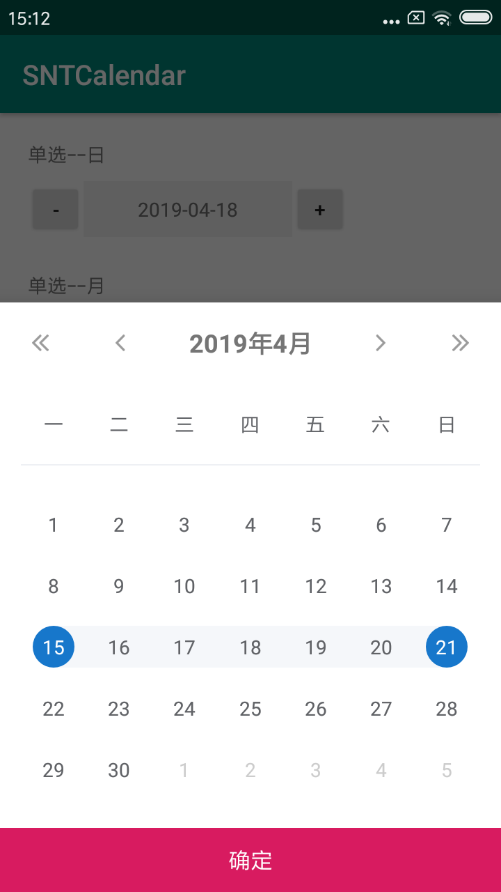
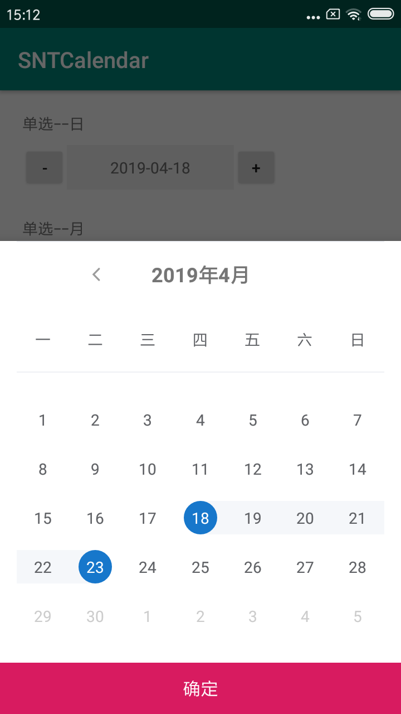
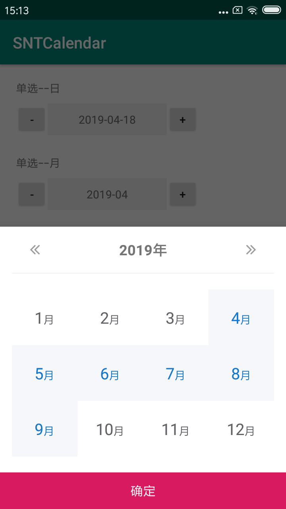

# SNTCalendar
多功能日历选择控件



# Usage

```gradle
dependencies {
    implementation 'com.snt.lib:snt_calendar_chooser:1.0.0'
}
```

## 单选日
```Java
private void setupSingleDay(){
    singleDayTV.setOnClickListener(new View.OnClickListener() {
        @Override
        public void onClick(View v) {
            getSingleDayChooser().show();//显示日历
        }
    });
    singleDayLastTV.setOnClickListener(new View.OnClickListener() {
        @Override
        public void onClick(View v) {
            getSingleDayChooser().selectLastDate();//显示上一日
        }
    });
    singleDayNextTV.setOnClickListener(new View.OnClickListener() {
        @Override
        public void onClick(View v) {
            getSingleDayChooser().selectNextDate();//显示下一日
        }
    });
    getSingleDayChooser().currentDate();//显示当前日期
}
private CalendarChooser getSingleDayChooser(){
    if (singleDayChooser == null){
        Calendar maxDate = Calendar.getInstance();
        maxDate.add(Calendar.DATE, 10);
        CalendarChooser.Builder builder = new CalendarChooser.Builder(this)
                .mode(ChooserMode.DAY)
                .currentDate(Calendar.getInstance())
                .maxDate(maxDate)
                .displayDateFormat(new SimpleDateFormat("yyyy-MM-dd", Locale.CHINA))
                .resultListener(new ChooseResultListener() {
                    @Override
                    public void choiceResult(SelectedDateItem result) {
                        singleDayTV.setText(result.getDisplayStr());
                    }
                });
        singleDayChooser = builder.build();
    }
    return singleDayChooser;
}
```


## 单选月
```Java
private void setupSingleMonth(){
    singleMonthTV.setOnClickListener(new View.OnClickListener() {
        @Override
        public void onClick(View v) {
            getSingleMonthChooser().show();//显示日历
        }
    });
    singleMonthLastTV.setOnClickListener(new View.OnClickListener() {
        @Override
        public void onClick(View v) {
            getSingleMonthChooser().selectLastDate();//显示上一月
        }
    });
    singleMonthNextTV.setOnClickListener(new View.OnClickListener() {
        @Override
        public void onClick(View v) {
            getSingleMonthChooser().selectNextDate();//显示下一月
        }
    });
    getSingleMonthChooser().currentDate();//显示当前日期
}
private CalendarChooser getSingleMonthChooser(){
    if (singleMonthChooser == null){
        Calendar maxDate = Calendar.getInstance();
        maxDate.add(Calendar.MONTH, 10);
        Calendar minDate = Calendar.getInstance();
        minDate.add(Calendar.MONTH, -10);
        CalendarChooser.Builder builder = new CalendarChooser.Builder(this)
                .mode(ChooserMode.MONTH)
                .currentDate(Calendar.getInstance())
                .maxDate(maxDate)
                .minDate(minDate)
                .displayDateFormat(new SimpleDateFormat("yyyy-MM", Locale.CHINA))
                .resultListener(new ChooseResultListener() {
                    @Override
                    public void choiceResult(SelectedDateItem result) {
                        singleMonthTV.setText(result.getDisplayStr());
                    }
                });
        singleMonthChooser = builder.build();
    }
    return singleMonthChooser;
}
```


## 选择周
```Java
private void setupSingleWeek(){
    singleWeekTV.setOnClickListener(new View.OnClickListener() {
        @Override
        public void onClick(View v) {
            getSingleWeekChooser().show();//显示日历
        }
    });
    singleWeekLastTV.setOnClickListener(new View.OnClickListener() {
        @Override
        public void onClick(View v) {
            getSingleWeekChooser().selectLastDate();//显示上一周
        }
    });
    singleWeekNextTV.setOnClickListener(new View.OnClickListener() {
        @Override
        public void onClick(View v) {
            getSingleWeekChooser().selectNextDate();//显示下一周
        }
    });
    getSingleWeekChooser().currentDate();//显示当前日期
}
private CalendarChooser getSingleWeekChooser(){
    if (singleWeekChooser == null){
        Calendar maxC = Calendar.getInstance();
        maxC.add(Calendar.DATE, 10);
        Calendar minC = Calendar.getInstance();
        minC.add(Calendar.DATE, -20);
        CalendarChooser.Builder builder = new CalendarChooser.Builder(this)
                .mode(ChooserMode.WEEK)
                .currentDate(Calendar.getInstance())
                .resultListener(new ChooseResultListener() {
                    @Override
                    public void choiceResult(SelectedDateItem result) {
                        singleWeekTV.setText(result.getDisplayStr());
                    }
                });
        singleWeekChooser = builder.build();
    }
    return singleWeekChooser;
}
```


## 选择日范围
```Java
private void setupScopeDay(){
    scopeDayTV.setOnClickListener(new View.OnClickListener() {
        @Override
        public void onClick(View v) {
            getScopeDayChooser().show();
        }
    });
    getScopeDayChooser().currentDate();
}
private CalendarChooser getScopeDayChooser(){
    if (scopeDayChooser == null){
        Calendar maxC = Calendar.getInstance();
        maxC.add(Calendar.DATE, 10);
        Calendar minC = Calendar.getInstance();
        minC.add(Calendar.DATE, -20);
        Calendar endC = Calendar.getInstance();
        endC.add(Calendar.DATE, 5);
        CalendarChooser.Builder builder = new CalendarChooser.Builder(this)
                .mode(ChooserMode.DAY_SCOPE)
                .currentDate(Calendar.getInstance())
                .minDate(minC)
                .maxDate(maxC)
                .selectStartDate(Calendar.getInstance())
                .selectEndDate(endC)
                .resultListener(new ChooseResultListener() {
                    @Override
                    public void choiceResult(SelectedDateItem result) {
                        scopeDayTV.setText(result.getDisplayStr());
                    }
                });
        scopeDayChooser = builder.build();
    }
    return scopeDayChooser;
}
```


## 选择月范围
```Java
private void setupScopeMonth(){
    scopeMonthTV.setOnClickListener(new View.OnClickListener() {
        @Override
        public void onClick(View v) {
            getScopeMonthChooser().show();
        }
    });
    getScopeMonthChooser().currentDate();
}
private CalendarChooser getScopeMonthChooser(){
    if (scopeMonthChooser == null){
        Calendar maxC = Calendar.getInstance();
        maxC.add(Calendar.MONTH, 10);
        Calendar minC = Calendar.getInstance();
        minC.add(Calendar.MONTH, -20);
        Calendar endC = Calendar.getInstance();
        endC.add(Calendar.MONTH, 5);
        CalendarChooser.Builder builder = new CalendarChooser.Builder(this)
                .mode(ChooserMode.MONTH_SCOPE)
                .currentDate(Calendar.getInstance())
                .minDate(minC)
                .maxDate(maxC)
                .selectStartDate(Calendar.getInstance())
                .selectEndDate(endC)
                .displayDateFormat(new SimpleDateFormat("yyyy-MM", Locale.CHINA))
                .resultListener(new ChooseResultListener() {
                    @Override
                    public void choiceResult(SelectedDateItem result) {
                        scopeMonthTV.setText(result.getDisplayStr());
                    }
                });
        scopeMonthChooser = builder.build();
    }
    return scopeMonthChooser;
}
```

